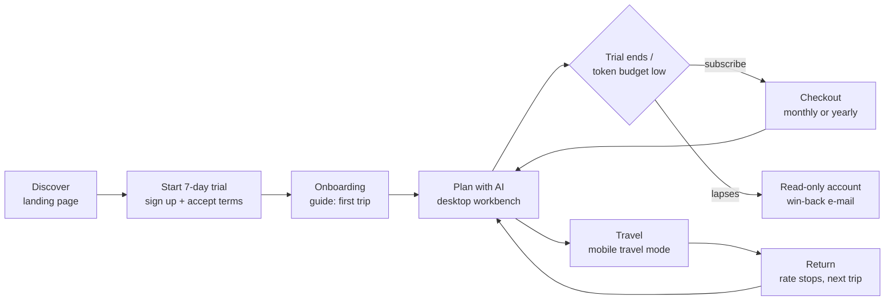
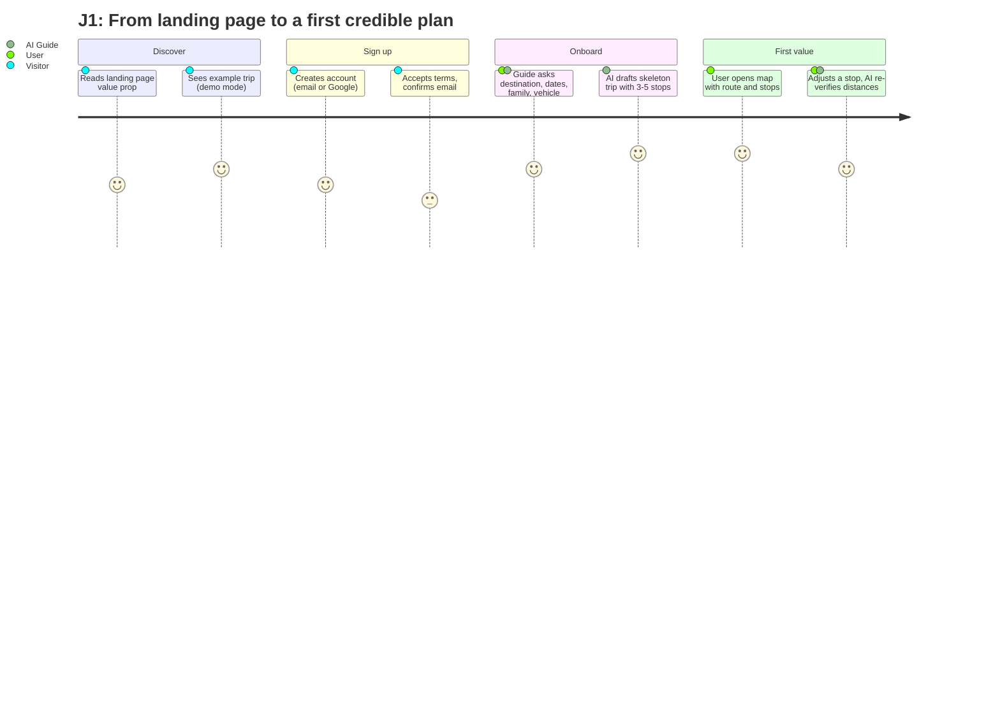
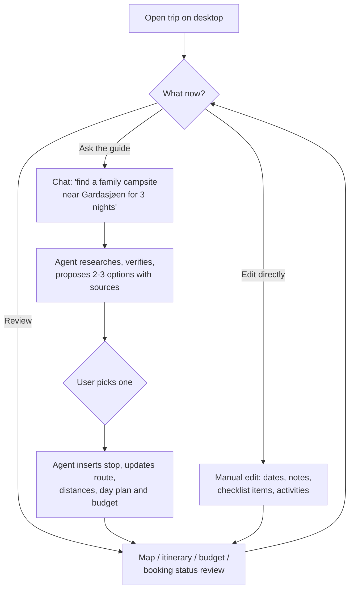
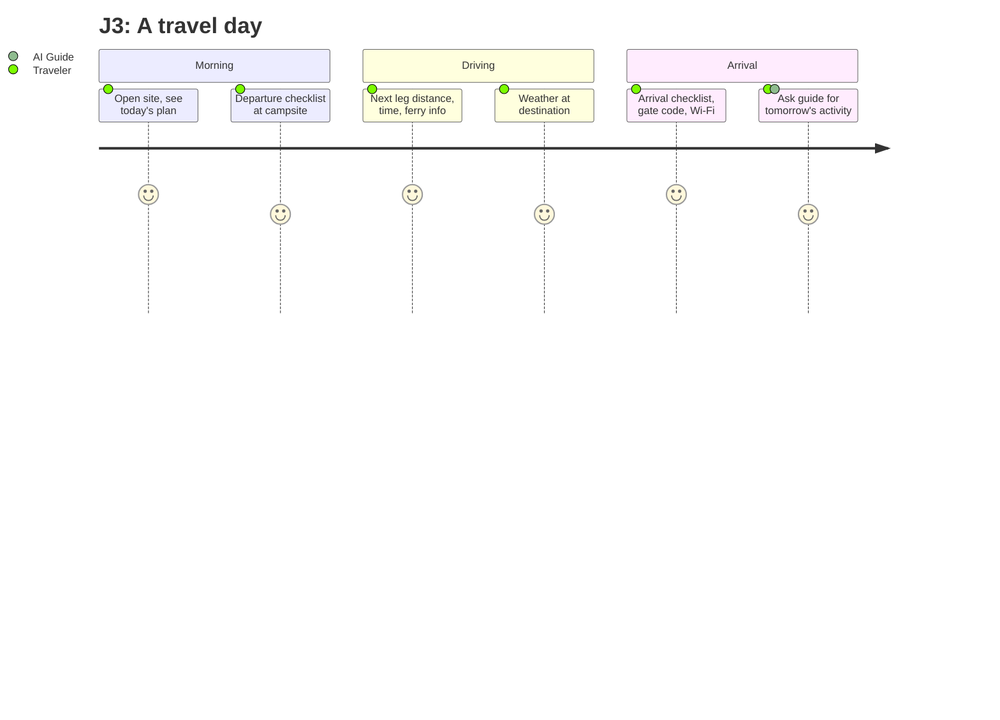

# 02 — User Journeys

> **Purpose:** Who the users are (personas) and how they move through the product from first visit
> to post-trip. Feature requirements in [03](03-functional-spec.md) trace to these journeys.

---

## 1. Personas

### P1 — "Kristine" (planning parent, primary)
38, two kids (5 and 9), caravan behind an EV or diesel SUV. Plans the summer trip from January.
Comfortable with apps, no patience for clunky ones. Plans on a laptop in the evening, checks on
mobile. Wants: confidence nothing is forgotten, family-fit campsites, control of budget.
Frustration triggers: stale links, wrong distances, re-entering data the AI already knows.

### P2 — "Jonas" (co-traveler)
41, Kristine's partner. Doesn't plan; consumes the plan. Opens the site from the driver's seat
stop (passenger!) to see today's plan, the next leg and the arrival checklist. Mobile only.
Success = zero learning curve: what he sees must resemble the plan Kristine showed him at home.

### P3 — "Sabine" (curious trial user)
55, from Cologne, considers a campervan rental for the first time. Lands from a camping-forum
link, wants to poke around before paying anything. The 7-day trial must show a credible plan for
*her* dream trip quickly — conversion happens inside the first session or not at all.

### P4 — The owner (Arne)
Controls structure, design, templates and community-data quality; monitors costs and metrics.
Not a persona in the consumer UI but has an admin journey (§6).

## 2. Journey overview

## 3. Journey J1 — Discover → first plan (P3 → P1 behavior)

Key requirements derived: landing page with demo trip ([03 §2](03-functional-spec.md)), signup with
terms gate ([07 §2](07-auth-security.md)), onboarding interview run by the agent
([06 §3](06-ai-agent-spec.md)), time-to-first-map < 5 minutes.

### The onboarding interview

The AI guide's first conversation deliberately mirrors how the sommerferie2026 plan was built:
interview → skeleton → iterate. It asks (adaptively, not as a form): destination/direction, dates
and duration, who travels (ages), vehicle and rig, driving tolerance per day, interests
(beach/city/nature/theme parks), budget sensitivity, booking style (book-ahead vs. wing-it).
The answers seed the trip profile ([05 §2](05-data-model.md)) that the agent uses in every session.

## 4. Journey J2 — Planning cycle (P1, desktop)

The core loop between onboarding and departure, typically over weeks:

Requirements derived: chat panel co-resident with map+itinerary on desktop ([09 §3](09-ux-design-spec.md)),
agent tool calls that edit the trip transactionally with user-visible diffs ("the agent changed X —
undo") ([06 §5](06-ai-agent-spec.md)), booking-status tracking per stop ([03 §4](03-functional-spec.md)).

## 5. Journey J3 — Travel mode (P2/P1, mobile)

Mirrors the proven sommerferie2026 on-the-road experience:

- Site opens in **travel mode** automatically during the trip dates: today's plan highlighted,
  next leg with distance/time, weather strip, arrival/departure checklists, country practical info.
- One-thumb navigation, sunlight-readable, works on flaky campsite Wi-Fi (cache-first reads).
- The guide is still available ("rain tomorrow — what can we do indoors near Bled?") and may
  propose plan adjustments, which sync to all family devices.

## 6. Journey J4 — Owner/admin (P4)

Monitor signups, subscriptions, AI cost per user, community-data quality (flag/remove bad
recommendations), publish template/checklist updates, adjust feature flags. Phase: dashboards are
`[v1.x]`; MVP uses Stripe dashboard + database queries + logs ([03 §9](03-functional-spec.md)).

## 7. Sync and multi-device expectations

One household, several devices: P1 plans on desktop, P2 reads on mobile — **same trip, live**.
This drives the move from sommerferie2026's localStorage to server-side storage with sync
([04](04-architecture.md), [05](05-data-model.md)). Checklist check-offs must propagate between
family devices in near-real-time during the trip (target ≤ 5 s when online).

> **Decision needed:** is multi-login family sharing (one subscription, several accounts) an MVP
> feature or is a shared login acceptable at first? — *working assumption: MVP = one account shared
> within the household (like sommerferie2026 in practice); named family members and roles are
> `[v1.x]` ([03 §8](03-functional-spec.md)).*

---

## Changelog

| Date | Change | By |
| --- | --- | --- |
| 2026-07-17 | Trial funnel replaces freemium in the journey overview (subscribe / lapse-to-read-only); P3 recast as a European trial user (Europe-first, D-06/D-07); Vipps removed from J1 signup options | Claude + Arne |
| 2026-07-16 | Document created — personas P1–P4, journeys J1–J4, onboarding interview, sync expectations | Claude + Arne |
