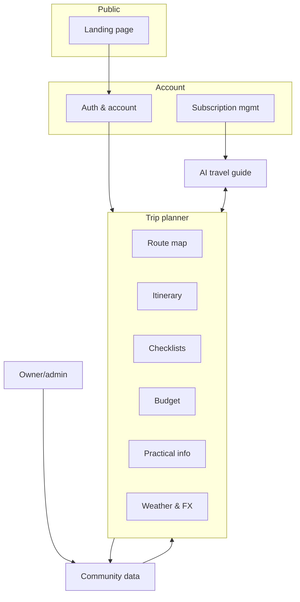

# 03 — Functional Specification

> **Purpose:** The feature catalogue. Every feature carries exactly one phase tag: `[MVP]`,
> `[v1.x]` (first post-MVP releases) or `[Later]`. Traces up to [01](01-product-vision.md)/[02](02-user-journeys.md),
> down to [04](04-architecture.md)–[09](09-ux-design-spec.md).

---

## 1. Module map

## 2. Landing page & public site

| ID | Feature | Phase |
| --- | --- | --- |
| LP-1 | Landing page: value proposition, product tour (screenshots of desktop + mobile), pricing table, CTA to sign up | `[MVP]` |
| LP-2 | Login entry point (and "continue where you left off" for returning users) | `[MVP]` |
| LP-3 | **Guided signup forwarding**: CTA leads into the AI-guided onboarding (create account → guide starts the first-trip interview, J1) | `[MVP]` |
| LP-4 | Interactive **demo trip** (read-only sample plan, no account needed) | `[v1.x]` |
| LP-5 | Public community heatmap teaser on landing page (anonymized, marketing) | `[Later]` |
| LP-6 | Terms, privacy policy and contact pages (content from [11](11-legal-terms.md)) | `[MVP]` |

## 3. Auth & account (detail in [07](07-auth-security.md))

| ID | Feature | Phase |
| --- | --- | --- |
| AC-1 | Email + password signup with email verification | `[MVP]` |
| AC-2 | OAuth login: Google | `[MVP]` |
| AC-3 | OAuth login: Vipps (Norwegian market) | `[v1.x]` |
| AC-4 | Mandatory versioned T&C acceptance at signup; re-acceptance on material change | `[MVP]` |
| AC-5 | Password reset, session management, logout everywhere | `[MVP]` |
| AC-6 | Account page: profile, trip profile defaults, data export (GDPR), delete account | `[MVP]` |
| AC-7 | Named family members with roles (planner/viewer) under one subscription | `[v1.x]` |

## 4. Trip planner (core, inherits sommerferie2026 feature set)

The planner replicates the proven sommerferie2026 structure per trip, generalized and server-backed.
Each trip has **planning mode** and **travel mode** (auto-selected by date, manually switchable).

### 4.1 Route map
| ID | Feature | Phase |
| --- | --- | --- |
| MAP-1 | Interactive map with stop markers, route polyline, popup per stop (dates, campsite, weather strip) | `[MVP]` |
| MAP-2 | Marker status colors: visited / active today / upcoming | `[MVP]` |
| MAP-3 | GPS position of device on map | `[MVP]` |
| MAP-4 | Click-to-add stop from map (reverse geocode → agent enriches) | `[v1.x]` |
| MAP-5 | Community layer: heatmap + recommended campsites near route | `[v1.x]` |

### 4.2 Itinerary (day-by-day)
| ID | Feature | Phase |
| --- | --- | --- |
| IT-1 | Ordered stops with dates, nights, campsite info, activities (must-do / nice-to-have) | `[MVP]` |
| IT-2 | Driving legs between stops: distance + estimated time (agent-verified, ÷73 km/h rule for caravan profiles; vehicle-profile dependent) | `[MVP]` |
| IT-3 | "Today" highlighted by device date; auto-expand current stop during trip | `[MVP]` |
| IT-4 | Booking status per stop (not booked / requested / confirmed, with reference) | `[MVP]` |
| IT-5 | Advance-booking list (activities that require pre-booking, with links) | `[v1.x]` |
| IT-6 | Drag-to-reorder stops with automatic re-dating and leg recalculation | `[v1.x]` |
| IT-7 | Trip versioning / undo of agent edits (visible diff, one-click revert) | `[MVP]` |

### 4.3 Checklists
| ID | Feature | Phase |
| --- | --- | --- |
| CHK-1 | Template checklists per trip type (packing, vehicle/caravan prep, before departure, arrival, departure) — owner-curated templates, user-customizable | `[MVP]` |
| CHK-2 | Check-off state synced server-side across devices (replaces localStorage) | `[MVP]` |
| CHK-3 | Per-list reset; per-mode visibility (planning vs travel) as in sommerferie2026 | `[MVP]` |
| CHK-4 | Agent fills/adjusts checklists from trip profile (5-year-old ⇒ child items, EV ⇒ charging gear) | `[MVP]` |

### 4.4 Budget & economy
| ID | Feature | Phase |
| --- | --- | --- |
| BUD-1 | Estimated budget by category with notes (fuel formula, camping, food, activities) | `[MVP]` |
| BUD-2 | Live FX rates + converter (frankfurter.dev pattern from sommerferie2026, country-aware preselect) | `[MVP]` |
| BUD-3 | Expense logging during trip vs. budget | `[Later]` |

### 4.5 Weather
| ID | Feature | Phase |
| --- | --- | --- |
| WX-1 | Per-stop forecast (Open-Meteo pattern: strips in popup/collapsed bar, hourly table in detail), cached server- or client-side 1 h | `[MVP]` |

### 4.6 Practical info
| ID | Feature | Phase |
| --- | --- | --- |
| PR-1 | Country cards auto-assembled from the trip's route: emergency numbers, speed limits (rig-aware), alcohol limits, tolls/vignettes, environmental zones, tipping culture | `[MVP]` |
| PR-2 | Per-stop practical details: gate codes, Wi-Fi, check-in/out times (private user data) | `[MVP]` |
| PR-3 | Owner-maintained country dataset with agent-assisted refresh and verification | `[MVP]` (seed 8 route countries) → all Europe `[v1.x]` |

## 5. AI travel guide (detail in [06](06-ai-agent-spec.md))

| ID | Feature | Phase |
| --- | --- | --- |
| AI-1 | Chat panel bound to the open trip; agent reads trip state and edits it via tools | `[MVP]` |
| AI-2 | Onboarding interview → skeleton trip (J1) | `[MVP]` |
| AI-3 | Research with verification: campsites, activities, distances, URLs — sources cited, unverified marked | `[MVP]` |
| AI-4 | Visible change-sets with undo (pairs with IT-7) | `[MVP]` |
| AI-5 | Proactive suggestions (weather-driven replanning, booking reminders) | `[v1.x]` |
| AI-6 | Message quota per tier (D-08) with graceful "quota reached" UX | `[MVP]` |
| AI-7 | Feedback (thumbs up/down per agent action) feeding quality metrics | `[MVP]` |

## 6. Subscription & payments (detail in [08](08-subscription-payments.md))

| ID | Feature | Phase |
| --- | --- | --- |
| PAY-1 | Free tier limits enforced (1 trip, AI quota) | `[MVP]` |
| PAY-2 | Stripe Checkout subscribe/upgrade; customer portal for card, cancel, invoices | `[MVP]`* |
| PAY-3 | Webhook-driven entitlement state (see lifecycle in 08 §4) | `[MVP]`* |
| PAY-4 | Seasonal pass product | `[Later]` |

*PAY-2/3 ship in MVP **code-complete but may launch dark** (everyone on free tier) if the MVP
launches as a closed beta — see [10 §3](10-roadmap.md).

## 7. Community data

| ID | Feature | Phase |
| --- | --- | --- |
| CM-1 | Anonymized aggregation pipeline: user trips → destination counts (heatmap source), campsite usage stats | `[v1.x]` |
| CM-2 | Heatmap view ("where is everyone going in July?") | `[v1.x]` |
| CM-3 | Campsite & activity recommendations surfaced in planner and to the agent, ranked by usage/ratings | `[v1.x]` |
| CM-4 | Post-trip ratings of stops/activities (1–5 + tags) | `[v1.x]` |
| CM-5 | Opt-out from contributing one's data to aggregates | ships with CM-1 `[v1.x]` |
| CM-6 | Owner moderation tools for community content | `[v1.x]` |

MVP note: the schema for community aggregates is designed in [05](05-data-model.md) from day one
(cheap), but no pipeline or UI ships in MVP (expensive).

## 8. Collaboration & sharing

| ID | Feature | Phase |
| --- | --- | --- |
| SH-1 | Read-only share link for a trip (grandparents follow along) | `[v1.x]` |
| SH-2 | Family member roles (see AC-7) | `[v1.x]` |
| SH-3 | Trip duplication / "use as template", incl. from public showcase trips | `[Later]` |

## 9. Owner/admin

| ID | Feature | Phase |
| --- | --- | --- |
| AD-1 | Ops via Stripe dashboard, DB console, structured logs (no custom UI) | `[MVP]` |
| AD-2 | Metrics dashboard: signups, conversion, AI cost/user, quota outliers | `[v1.x]` |
| AD-3 | Template & country-data editor (owner content) | `[v1.x]` |
| AD-4 | Feature flags per tier/user | `[v1.x]` |

## 10. Non-functional requirements

| ID | Requirement | Phase |
| --- | --- | --- |
| NF-1 | Norwegian UI at launch; all copy behind an i18n layer so EN/SE/DK can follow | `[MVP]` |
| NF-2 | Mobile travel mode usable on slow connections: cache-first reads for the active trip, ≤ 200 kB critical path | `[MVP]` |
| NF-3 | WCAG 2.1 AA (contrast, keyboard, ARIA — continue sommerferie2026 practice) | `[MVP]` |
| NF-4 | P95 interactive < 3 s on mid-range mobile; map tiles lazy | `[MVP]` |
| NF-5 | GDPR: EU data residency, export, deletion ([07 §5](07-auth-security.md)) | `[MVP]` |
| NF-6 | Availability target 99.5 % (managed platform SLAs suffice; no custom HA work) | `[MVP]` |
| NF-7 | Near-real-time checklist/trip sync between household devices (≤ 5 s online) | `[MVP]` |

---

## Changelog

| Date | Change | By |
| --- | --- | --- |
| 2026-07-16 | Document created — module map and full feature catalogue LP/AC/MAP/IT/CHK/BUD/WX/PR/AI/PAY/CM/SH/AD/NF with phase tags | Claude + Arne |
