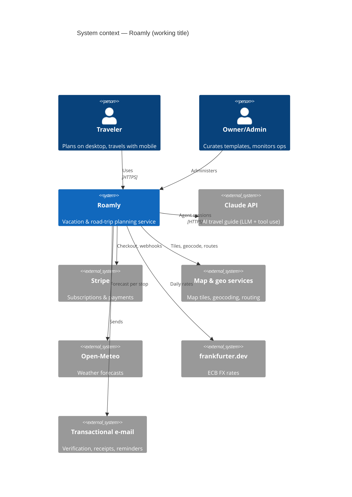
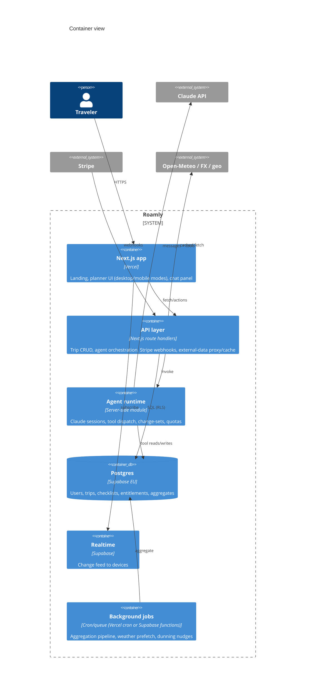

# 04 — Architecture

> **Purpose:** System structure, technology choices and the reasoning behind them (D-02: the spec
> prescribes a concrete stack). Implements the requirements of [03](03-functional-spec.md); the
> data layer is detailed in [05](05-data-model.md), the agent runtime in [06](06-ai-agent-spec.md).

---

## 1. System context

## 2. Stack decision

### 2.1 Options considered

| Option | Sketch | Pros | Cons |
| --- | --- | --- | --- |
| **A. Next.js + Supabase + Vercel** (chosen) | Next.js App Router frontend+API; Supabase = Postgres + Auth + RLS + Realtime + Storage; Stripe; Claude API from server routes | One language (TS) end-to-end; auth/DB/realtime managed with EU region; RLS matches the strict per-user ownership model; generous free tiers for a solo build; huge ecosystem; Claude builds very effectively in it | Vendor coupling (mitigated: plain Postgres + standard OAuth underneath); serverless limits on long agent runs (mitigated: streaming + background jobs) |
| B. SvelteKit + self-hosted Postgres on a VPS (Hetzner/Coolify) | Full control, EU hosting, low fixed cost | Most operational burden on one person (backups, auth hardening, realtime); slower to MVP | |
| C. Static SPA + Firebase | Fast start, realtime built in | NoSQL fits the relational trip model poorly; weaker EU/GDPR story; agent server logic still needs functions; further from SQL skills the data model wants | |

**Decision (D-02):** Option A. The solo-developer + Claude-assisted workflow values managed
services, one language and strong conventions above all; Postgres + RLS is the cleanest match for
"user owns trip, community sees aggregates".

### 2.2 Chosen components

| Concern | Choice | Notes |
| --- | --- | --- |
| Web app | **Next.js (App Router, TypeScript)** | SSR landing page (SEO) + app shell; API route handlers for server logic |
| Hosting | **Vercel** | Preview deploys per PR (pairs with [13](13-dev-workflow.md)); EU functions region |
| Database | **Supabase Postgres (EU region)** | Schema in [05](05-data-model.md); Row-Level Security enforces ownership |
| Auth | **Supabase Auth** | Email+password, Google `[MVP]`; per-market logins `[Later]` ([07](07-auth-security.md)) |
| Realtime sync | **Supabase Realtime** | Postgres changes → subscribed family devices (NF-7) |
| AI agent | **Claude API** (Messages + tool use; Agent SDK where it fits) | Runtime pattern in [06](06-ai-agent-spec.md); called only server-side |
| Payments | **Stripe** Checkout + Billing + Customer Portal | Webhooks → entitlements ([08](08-subscription-payments.md)) |
| Map | **MapLibre GL + OpenStreetMap-based tiles**; Leaflet acceptable fallback | Geocoding/routing: OSM-based services (e.g. Nominatim/OSRM-class, or a hosted provider) — final provider selection is an implementation task with rate-limit/ToS check *(unverified)* |
| Weather / FX | **Open-Meteo** / **frankfurter.dev** | Proven in sommerferie2026; fetched server-side and cached (§4) |
| E-mail | Transactional provider (e.g. Resend/Postmark) | Selection at implementation *(unverified pricing)* |
| Styling | **Tailwind CSS** (build-time, not CDN) | Tokens from [09](09-ux-design-spec.md) |
| State/UI | React Server Components + a light client store; no heavyweight state framework | |

## 3. Container view

Key boundaries:
- **Claude API keys never reach the client.** All agent traffic is server-side; the client talks to
  our API which streams agent output.
- **RLS everywhere.** Even our own API uses the requesting user's context for trip data; only the
  aggregation jobs and admin paths use service-role access, and they are the only writers of the
  `community` schema ([05 §4](05-data-model.md)).
- **External data is proxied and cached** server-side (weather, FX, geocoding) — protects rate
  limits, hides no keys today but keeps the option, and lets travel mode read from cache (NF-2).

## 4. External data & caching strategy

Carried over from sommerferie2026 and generalized: every third-party fetch has (TTL cache, stale-on-
error fallback, graceful "not available" UI). Weather 1 h TTL per stop-coordinates; FX 1 h; geocode
results persisted permanently on the stop record; community aggregates recomputed nightly (§jobs).

## 5. Environments

| Env | Purpose | Data |
| --- | --- | --- |
| `local` | Development; Supabase local or dev project; Stripe test mode; Claude API dev key with low budget | Seed data |
| `preview` | Vercel preview per PR against dev database branch | Seed data |
| `production` | Live | Real data, EU region |

Secrets live in Vercel/Supabase env config only — never in the repo ([13 §6](13-dev-workflow.md)).

## 6. Scale assumptions

Design point: 5 000 registered users / 500 concurrent during summer peak — comfortably inside
managed-tier capacity; no custom scaling work in scope. Cost model for AI (the only usage-priced
dependency that matters) is in [06 §8](06-ai-agent-spec.md).

---

## Changelog

| Date | Change | By |
| --- | --- | --- |
| 2026-07-17 | Renamed to Roamly (D-05); auth row updated (per-market logins moved to Later, D-06) | Claude + Arne |
| 2026-07-16 | Document created — context/container diagrams, stack decision (Option A: Next.js + Supabase + Vercel + Stripe + Claude API), boundaries, caching, environments | Claude + Arne |
