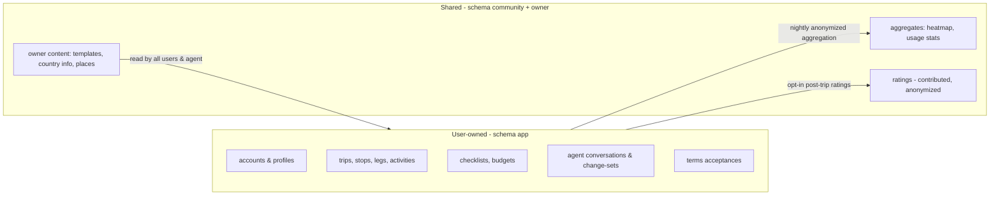
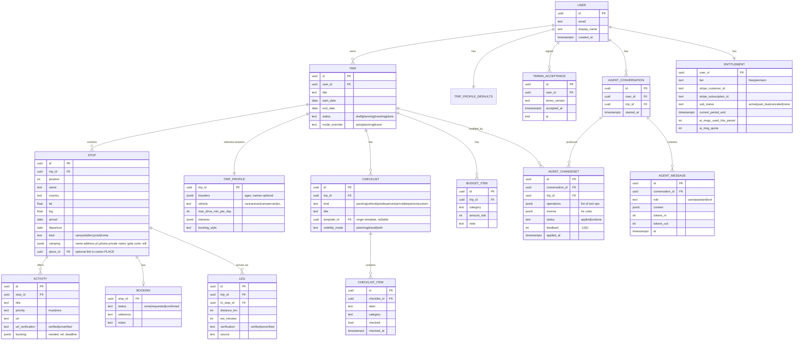
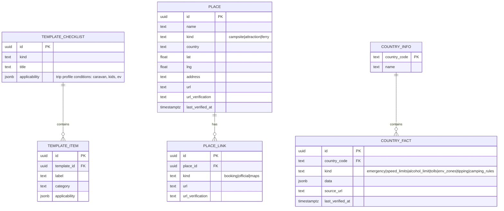
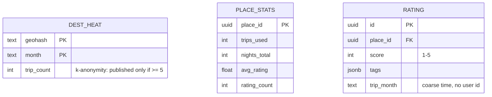

# 05 — Data Model

> **Purpose:** What data exists, who owns it, and how it relates. Two clearly separated domains:
> **user-owned data** (private by default, RLS-protected) and **shared/community data** (owner- or
> pipeline-written aggregates). Implements [03](03-functional-spec.md); enforced per
> [04 §3](04-architecture.md) and [07](07-auth-security.md).

---

## 1. Domain overview

Ownership rule: rows in the `app` schema always carry the owning `user_id` and are RLS-guarded to
that user. Rows in `community`/`owner` schemas contain **no user identifiers** (aggregates) or only
owner authorship (curated content); they are world-readable inside the product, and written only by
the aggregation jobs, the ratings endpoint (which strips identity), or the owner.

## 2. User-owned data (ER)

Notes:
- `AGENT_CHANGESET.inverse` powers IT-7/AI-4 (visible diff + one-click undo) without full trip
  versioning in MVP.
- `LEG.verification` and `ACTIVITY.url_verification` make the agent's verification duty
  ([06 §4](06-ai-agent-spec.md)) a **data property the UI can render** (badge/asterisk), not just a
  process rule.
- Sensitive per-stop secrets (gate codes, Wi-Fi passwords) live inside the user's own `STOP.camping`
  jsonb — unlike sommerferie2026 they are per-user private rows, never in code (contrast:
  old repo's §6.4 private-repo exception).
- `ENTITLEMENT` is the single read model for tier gating; it is written only by Stripe webhook
  handlers and the quota accountant ([08](08-subscription-payments.md)).

## 3. Owner content (curated, world-readable)

`PLACE` is the shared registry the agent and community stats hang on: when two users camp at the
same site, both stops link the same `place_id` — that linkage (not user rows) feeds recommendations.
`COUNTRY_FACT` generalizes sommerferie2026's practical-info tables (emergency numbers, rig speed
limits, alcohol limits, tipping…) with per-fact source and verification timestamp (PR-1/PR-3).

## 4. Community aggregates (anonymized)

Privacy rules (bind [07 §5](07-auth-security.md) and [11](11-legal-terms.md)):
1. Aggregation pipeline (nightly job) is the **only** reader of `app` data that writes to
   `community`; it strips all identifiers and coarsens location (geohash ~10 km) and time (month).
2. **k-anonymity ≥ 5**: heatmap cells and place stats are published only above the threshold.
3. Users can opt out (CM-5): their trips are excluded from the next pipeline run.
4. Ratings are voluntary, stored without user linkage beyond an internal dedup hash.

## 5. Migration & seed strategy

- Schema migrations are SQL files in the new repo (`db/migrations`, [14 §4](14-claude-setup.md)),
  applied via Supabase CLI; every migration PR-reviewed like code ([13](13-dev-workflow.md)).
- Seed data: owner templates converted from sommerferie2026's checklists, the 8 route countries'
  `COUNTRY_FACT`s, and ~15 verified `PLACE` rows from the 2026 trip — giving the agent and demo
  trip real, verified content on day one ([06 §7](06-ai-agent-spec.md)).

---

## Changelog

| Date | Change | By |
| --- | --- | --- |
| 2026-07-16 | Document created — user/owner/community domains, ER diagrams, verification-as-data, privacy rules, seed strategy | Claude + Arne |
