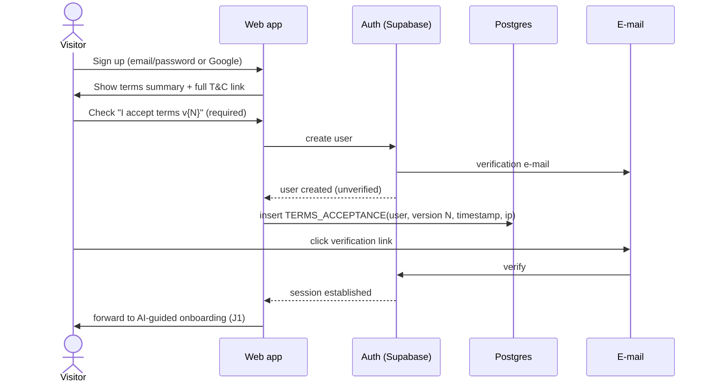

# 07 — Authentication & Security

> **Purpose:** How users prove who they are, what they may access, and how personal data is
> protected. Implements AC-1…AC-7 ([03 §3](03-functional-spec.md)) on the Supabase Auth + RLS
> foundation chosen in [04](04-architecture.md). Terms content lives in [11](11-legal-terms.md).

---

## 1. Authentication methods

| Method | Phase | Notes |
| --- | --- | --- |
| Email + password (verified email) | `[MVP]` | Supabase Auth; passwords argon2/bcrypt-hashed by the platform, never visible to us |
| Google OAuth | `[MVP]` | Lowest-friction for the target group |
| Vipps Login (OIDC) | `[v1.x]` | Strong fit for Norway-first launch; requires Vipps merchant agreement *(unverified — confirm requirements at implementation)* |
| Magic link (email) | `[Later]` | Candidate to replace passwords entirely |

Session model: short-lived JWT access token + rotating refresh token (Supabase default), httpOnly
cookies via the Next.js auth helpers. "Log out everywhere" revokes refresh tokens (AC-5).

## 2. Signup flow (with T&C gate)

Rules:
- The accept-checkbox is **unchecked by default** and blocks account creation (AC-4; legal basis
  in [11 §4](11-legal-terms.md)).
- Acceptance is recorded per terms **version**; a material terms change gates the next login with
  a re-acceptance screen, recorded as a new `TERMS_ACCEPTANCE` row.
- OAuth signups pass the same gate before the account becomes usable.

## 3. Login, reset, session

- Login: standard email/password or OAuth; unverified accounts prompted to re-send verification.
- Password reset: email link → token-checked reset page (Supabase flow); all sessions revoked on
  password change.
- Brute-force protection: platform rate limits + exponential backoff on the form.
- 2FA (TOTP): `[Later]` — low-sensitivity product, revisit if accounts gain payment methods
  beyond Stripe-hosted.

## 4. Authorization model

| Principal | May |
| --- | --- |
| Anonymous | Landing page, terms, (later) demo trip |
| Authenticated user | CRUD own `app.*` rows only (RLS: `user_id = auth.uid()`), read `owner`/`community` schemas |
| AI agent | Same as its user — tools run under the user's identity ([06 §4](06-ai-agent-spec.md) rule 3); no service-role access |
| Aggregation job | Service role, read `app.*` / write `community.*` — the only cross-user reader |
| Owner/admin | Service role via admin surface, audited |

Every table in `app.*` gets an RLS policy in the same migration that creates it — enforced by a
[12](12-testing-verification.md) test that fails on any RLS-less table.

## 5. Privacy & GDPR

- **Data residency:** Supabase project + Vercel functions in EU regions (NF-5).
- **Lawful basis:** contract performance (trip data, account), consent (community contribution —
  opt-out CM-5, marketing e-mail), legitimate interest (fraud/abuse logs).
- **Data subject rights:** self-service export (JSON of all `app.*` rows for the user, AC-6) and
  account deletion — hard-deletes user rows; already-published anonymized aggregates are not
  reversible (documented in [11](11-legal-terms.md) privacy policy).
- **Retention:** agent conversations kept 12 months then pruned (quota accounting needs current
  period only); logs 90 days. Values confirmed in the privacy policy.
- **Processors:** Supabase, Vercel, Stripe, Anthropic, e-mail provider — listed in the privacy
  policy with DPAs. Claude API calls run under Anthropic's commercial terms (no training on our
  data); trip content sent to the model is the user's own data, minimum necessary.
- **Anonymization boundary:** the k≥5/geohash/month rules of [05 §4](05-data-model.md) are a
  privacy control, not just a product rule.

## 6. Application security baseline

- All traffic HTTPS; HSTS; secure/httpOnly/SameSite cookies.
- Input validation at API boundary (zod schemas); parameterized queries only (Supabase client).
- Secrets in platform env config only ([13 §6](13-dev-workflow.md)); no secrets in code — explicit
  break from sommerferie2026's private-repo exception.
- Stripe webhooks signature-verified; agent web-fetch content treated as untrusted
  ([06 §4](06-ai-agent-spec.md) rule 7).
- Dependency scanning + secret scanning in CI ([12](12-testing-verification.md)); `npm audit`
  gate on high severity.
- Structured audit log for auth events, admin actions, agent change-sets.

---

## Changelog

| Date | Change | By |
| --- | --- | --- |
| 2026-07-16 | Document created — auth methods, signup sequence with versioned T&C gate, authorization/RLS model, GDPR, security baseline | Claude + Arne |
