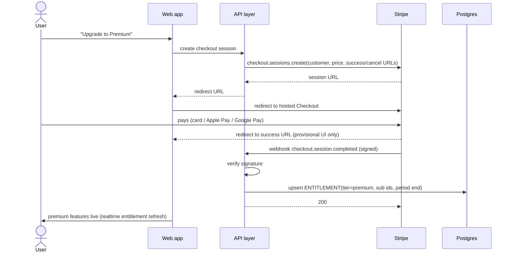
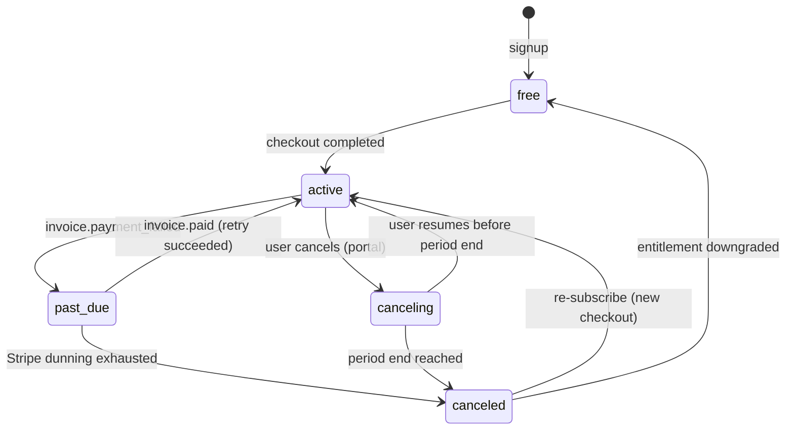

# 08 — Subscription & Payments

> **Purpose:** How the service earns money: tiers, Stripe integration, billing lifecycle and its
> consequences for entitlements. Implements PAY-1…PAY-4 ([03 §6](03-functional-spec.md)); tier
> definitions trace to [01 §6](01-product-vision.md) (D-07); legal terms in [11](11-legal-terms.md).

---

## 1. Tiers & entitlements

| | Free | Premium |
| --- | --- | --- |
| Price | 0 | ≈ 99 NOK/mo or 799 NOK/yr *(working numbers, D-07)* |
| Trips | 1 | Unlimited |
| AI guide | ~20 msgs/mo | ~500 msgs/mo fair use (D-08) |
| Community data | Read | Read + contribute + full recommendations |
| Export (PDF/offline) `[v1.x]` | — | ✓ |
| Share links `[v1.x]` | — | ✓ |

Candidate add-on `[Later]`: **seasonal pass** (~249 NOK / 3 months) matching vacation rhythm —
schema-compatible (an entitlement with fixed `current_period_end`, no renewal).

Enforcement: single `ENTITLEMENT` row per user ([05 §2](05-data-model.md)) is the only source of
truth read by the app and the agent quota accountant. Downgrade semantics: on losing premium,
extra trips become **read-only** (never deleted); AI quota drops to free at next period.

## 2. Stripe integration shape

- **Stripe Checkout** (hosted page) for subscribe/upgrade — no card data ever touches our domain
  (SAQ-A scope).
- **Stripe Customer Portal** for card update, plan switch, cancel, invoices (PAY-2) — buys the
  whole self-service billing UI for free.
- **Stripe Billing** products/prices: `premium_monthly`, `premium_yearly` (NOK), automatic tax
  (MVA) enabled — see [11 §6](11-legal-terms.md) for consumer-law notes.
- **Webhooks are the only writer of entitlements.** The app never assumes success from a redirect.

## 3. Checkout flow

Webhook handling rules: verify signature; idempotent by event id (processed-events table);
process `checkout.session.completed`, `customer.subscription.updated`, `customer.subscription.deleted`,
`invoice.payment_failed`, `invoice.paid`; unknown events acknowledged and logged. Retries safe.

## 4. Subscription lifecycle

- **Dunning:** delegated to Stripe Smart Retries + its reminder e-mails; in `past_due` the app
  shows a fix-payment banner (features stay on during the grace window).
- **Cancel:** always effective at period end (no mid-period refund by default — angrerett
  handling in [11 §6](11-legal-terms.md)); user keeps premium until then.
- **Upgrades/downgrades** (monthly↔yearly): Stripe proration defaults.

## 5. AI quota accounting

- `ai_msgs_used_this_period` increments per user message that reaches the model; period resets on
  `current_period_end` rollover (webhook-driven for premium, calendar-month for free).
- Quota check happens **before** the model call; exhaustion returns the friendly quota screen
  ([06 §3](06-ai-agent-spec.md)), offering upgrade (free) or reset date (premium).
- Abuse guard: independent per-user daily cap and per-message output cap ([06 §8](06-ai-agent-spec.md)).

## 6. Testing & operations

- All flows built against **Stripe test mode** with stripe-cli webhook forwarding locally;
  [12 §4](12-testing-verification.md) specifies the required test matrix (success, 3DS, failure,
  dunning, cancel-resume, webhook replay/idempotency).
- MVP ops = Stripe Dashboard (AD-1); revenue metrics in AD-2 `[v1.x]`.
- Launch-dark option: PAY-* ships code-complete but disabled during closed beta
  ([10 §3](10-roadmap.md)).

> **Decision needed:** confirm price points and whether yearly billing ships at MVP or `[v1.x]` —
> *working assumption: both monthly and yearly at payments launch; prices per D-07.*

---

## Changelog

| Date | Change | By |
| --- | --- | --- |
| 2026-07-16 | Document created — tiers/entitlements, Stripe Checkout+Portal shape, checkout sequence, lifecycle state machine, quota accounting, test matrix pointer | Claude + Arne |
