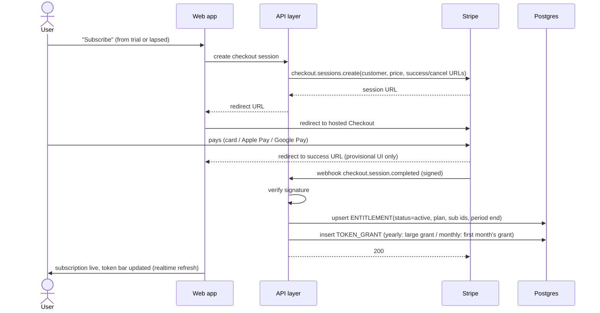
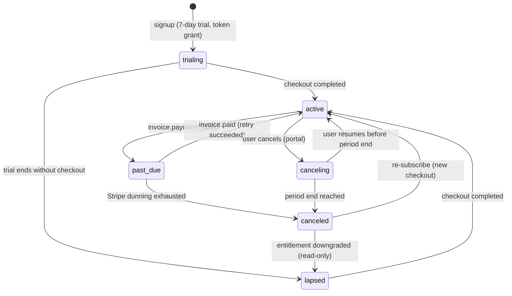

# 08 — Subscription & Payments

> **Purpose:** How the service earns money: tiers, Stripe integration, billing lifecycle and its
> consequences for entitlements. Implements PAY-1…PAY-4 ([03 §6](03-functional-spec.md)); tier
> definitions trace to [01 §6](01-product-vision.md) (D-07); legal terms in [11](11-legal-terms.md).

---

## 1. Trial, subscription & entitlements (D-07/D-08, confirmed)

| | Free trial (7 days) | Subscription |
| --- | --- | --- |
| Price | 0 — starts at signup, **no card required** | ≈ 99 NOK (~€9)/mo or 799 NOK (~€70)/yr *(working numbers; EUR-primary display via Stripe multi-currency)* |
| Trips | 1 | Unlimited |
| AI guide | Small fixed **token grant** at signup | **Token budget unlocked in proportion to payment**: yearly-upfront → one large immediate grant; monthly → a grant per paid month (12 monthly grants sum to more than the yearly grant — the flexibility premium). Usage bar; hard stop at zero |
| Community data | Read | Read + contribute + full recommendations |
| Export (PDF/offline), share links `[v1.x]` | — | ✓ |

Candidate add-on `[Later]`: **seasonal pass** — schema-compatible (an entitlement with fixed
`current_period_end`, no renewal).

Enforcement: single `ENTITLEMENT` row per user with `token_balance` + the `TOKEN_GRANT` ledger
([05 §2](05-data-model.md)) is the only source of truth read by the app and the agent's token
accountant. Lapse semantics (trial expired or subscription ended): trips become **read-only**
(never deleted), remaining token balance is forfeited, win-back e-mail sent.

> **Decision needed:** card-free trial (assumed — lowest friction; trial managed app-side, Stripe
> enters only at subscribe) vs. card-upfront trial via Stripe `trial_period_days` (auto-converts,
> filters for serious users). — *Working assumption: card-free.*

## 2. Stripe integration shape

- **Stripe Checkout** (hosted page) for subscribe/upgrade — no card data ever touches our domain
  (SAQ-A scope).
- **Stripe Customer Portal** for card update, plan switch, cancel, invoices (PAY-2) — buys the
  whole self-service billing UI for free.
- **Stripe Billing** products/prices: `sub_monthly`, `sub_yearly` with **multi-currency prices
  (EUR primary; GBP/NOK/SEK/DKK/CHF as needed)** and automatic tax (EU VAT via OSS) enabled — see
  [11 §6](11-legal-terms.md) for consumer-law notes.
- **Webhooks are the only writer of entitlements.** The app never assumes success from a redirect.

## 3. Checkout flow

Webhook handling rules: verify signature; idempotent by event id (processed-events table);
process `checkout.session.completed`, `customer.subscription.updated`, `customer.subscription.deleted`,
`invoice.payment_failed`, `invoice.paid`; unknown events acknowledged and logged. Retries safe.

## 4. Subscription lifecycle

- **Dunning:** delegated to Stripe Smart Retries + its reminder e-mails; in `past_due` the app
  shows a fix-payment banner (features stay on during the grace window).
- **Cancel:** always effective at period end (no mid-period refund by default — angrerett
  handling in [11 §6](11-legal-terms.md)); user keeps premium until then.
- **Upgrades/downgrades** (monthly↔yearly): Stripe proration defaults.

## 5. Token accounting (PAY-5, D-08)

- **Grants** are written as `TOKEN_GRANT` rows by webhook handlers only: trial grant at signup
  (app-side), a large grant on `checkout.session.completed` for yearly, and a monthly grant on each
  `invoice.paid` for monthly plans — the unlock schedule is thus driven by actual money received.
- **Usage** decrements `token_balance` by the measured tokens of each agent message; balance check
  happens **before** the model call; zero balance returns the friendly hard-stop screen
  ([06 §3](06-ai-agent-spec.md)) — subscribe (trial/lapsed) or next-grant date / switch-to-yearly
  (monthly subscribers).
- The **usage bar** reads balance + rolling average cost/message to show "≈ N requests left".
- Grant sizes are configuration, not code — recalibrated from v0.x usage data before public
  launch ([06 §8](06-ai-agent-spec.md), [10 §1](10-roadmap.md)).
- Abuse guards independent of budgets: per-user daily burst cap and per-message output cap.

## 6. Testing & operations

- All flows built against **Stripe test mode** with stripe-cli webhook forwarding locally;
  [12 §4](12-testing-verification.md) specifies the required test matrix (success, 3DS, failure,
  dunning, cancel-resume, webhook replay/idempotency).
- MVP ops = Stripe Dashboard (AD-1); revenue metrics in AD-2 `[v1.x]`.
- Launch-dark option: PAY-* ships code-complete but disabled during closed beta
  ([10 §3](10-roadmap.md)).

Both monthly and yearly ship at payments launch (the unlock schedule requires both); prices per
D-07, finalized together with grant sizes after v0.x calibration.

---

## Changelog

| Date | Change | By |
| --- | --- | --- |
| 2026-07-17 | D-07/D-08 applied: freemium replaced by 7-day card-free trial + single subscription; §5 rewritten as token accounting with webhook-driven TOKEN_GRANTs (yearly large upfront, monthly per invoice.paid) and hard stop; lifecycle gains trialing/lapsed states; EUR-primary multi-currency prices with EU VAT (OSS); yearly-at-launch decision resolved (both plans ship) | Claude + Arne |
| 2026-07-16 | Document created — tiers/entitlements, Stripe Checkout+Portal shape, checkout sequence, lifecycle state machine, quota accounting, test matrix pointer | Claude + Arne |
