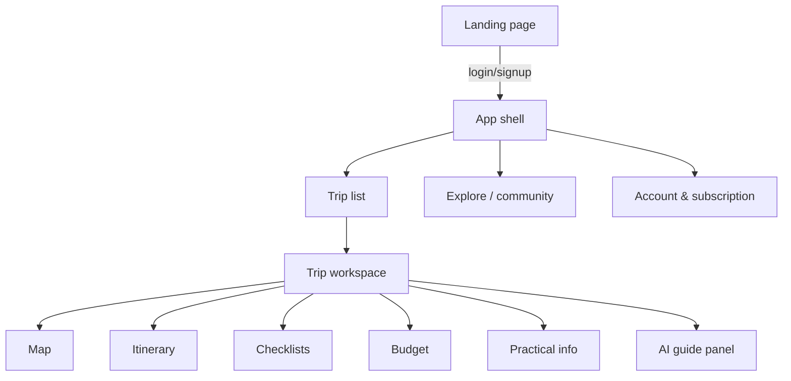

# 09 — UX & Design Specification

> **Purpose:** Information architecture, layouts and visual system. Desktop becomes a real
> planning workbench (using the available real estate); mobile closely mirrors the proven
> sommerferie2026 structure. Visual identity evolves the sommerferie2026 look (D-04). The living
> component library is `design-system/` in this folder, synced to the **Claude Design** project (§6).

---

## 1. Design principles

Carried over from sommerferie2026 and extended:

1. **Simple and scannable** — compact overview first, depth on demand.
2. **Vacation & nature mood** — warm, inviting, sunlight-readable.
3. **Desktop plans, mobile travels** — two optimized experiences, one mental model.
4. **The map is home base** — geography anchors everything.
5. **Trust surfaces** — verification badges, sources, change-sets are visible design elements.

## 2. Information architecture



The five trip sections are the sommerferie2026 top menu, generalized per trip. Planning/travel
mode ([03 §4](03-functional-spec.md)) filters content within them exactly as today.

## 3. Desktop layout (≥ 1024 px) — the planning workbench

Three-column workspace (the key upgrade over the single-column site):

```
┌────────────────────────────────────────────────────────────────────┐
│ Top bar: logo · trip switcher · mode toggle · quota · account      │
├──────────────┬──────────────────────────────────┬──────────────────┤
│ Nav rail     │  Main canvas                     │  AI guide panel  │
│ Map          │  ┌────────────┬───────────────┐  │  (persistent,    │
│ Itinerary    │  │ Map        │ Itinerary     │  │  collapsible)    │
│ Checklists   │  │ (sticky)   │ list w/       │  │                  │
│ Budget       │  │ markers,   │ stop cards,   │  │  chat stream     │
│ Practical    │  │ route      │ legs, weather │  │  change-set      │
│              │  └────────────┴───────────────┘  │  cards w/ undo   │
│              │  (other sections use full width) │  input + quota   │
├──────────────┴──────────────────────────────────┴──────────────────┤
│ Status strip: today pin (during trip) · sync state                 │
└────────────────────────────────────────────────────────────────────┘
```

- **Map + itinerary side-by-side** is the default planning view: clicking a stop card pans the
  map; clicking a marker scrolls/expands the card (two-way linking).
- The **AI guide panel** (~360 px) is always available; agent edits animate into the canvas so
  cause and effect are visible. Collapsible to a launcher button.
- Checklists/budget/practical use the freed width for two-column card grids and full tables
  (no horizontal scroll fades needed on desktop).
- Keyboard: `⌘K` command palette `[v1.x]`; arrows navigate stops.

## 4. Mobile layout (< 768 px) — the travel companion

Deliberately mirrors sommerferie2026 (P2's zero-learning-curve requirement, J3):

- Single column; top bar with hamburger + mode toggle + quick-access icons (currency, SOS).
- Section order = today's proven order: Map → Itinerary (today highlighted, auto-expanded during
  trip) → Checklists (arrival/departure tabs on the road) → Practical info.
- Sticky "Today: day X/Y" pin during the trip; one-thumb accordion interactions; 44 px touch
  targets; 16 px minimum body text.
- AI guide is a floating button → full-height slide-over (not persistent — screen space is for
  the plan).
- Tablet (768–1024): mobile structure with two-column cards; map+itinerary split appears at the
  desktop breakpoint.

## 5. Visual identity & tokens (D-04)

Evolved from sommerferie2026's spec §5.5–5.7; tokens live as CSS variables and are the source for
`design-system/tokens/`:

| Token | Value | Origin/role |
| --- | --- | --- |
| `--color-primary` | `#1B4F72` petrol | Nav, links, map accents |
| `--color-secondary` | `#F5DEB3` warm sand | Section backgrounds |
| `--color-bg` | `#FBF5E6` cream | Page background |
| `--color-accent` | `#F4A621` sunshine | Today-markers, CTAs, highlights |
| `--color-text` | `#2C3E50` ink | Body text |
| `--color-success` | `#27AE60` | Confirmed bookings, verified badges |
| `--color-muted` | `#607080` | Meta text (WCAG AA-checked) |
| `--color-danger` | `#C0392B` | Errors, max-temp, destructive |
| Headings | Playfair Display (serif) | Travel mood |
| Body/UI | Inter (sans) | Readability incl. sunlight |
| Radius / spacing / shadows | 4-px spacing scale, `rounded-xl` cards, soft shadows | Defined in tokens files |

New semantic components beyond the 2026 site: **verification badge** (verified/unverified),
**change-set card** (agent edit + undo), **quota meter**, **tier badge**, **community heat layer**
styling. Photography rules carry over (real destination photos, no emoji, flags for countries).

Light mode only at launch (sunlight readability priority); dark mode `[Later]`.

## 6. Design system & Claude Design workflow

- Source of truth: `product_plan/design-system/` — self-contained HTML previews with first-line
  `<!-- @dsCard group="…" -->` markers. Structure: `tokens/` (colors, typography, spacing) and
  `components/` (buttons, cards, trip-stop-card, nav desktop/mobile, checklist, AI-chat panel,
  map panel).
- Synced file-by-file to the Claude Design project **"Feriekartet Design System"** on
  claude.ai/design via DesignSync — the visual gallery for reviewing and evolving components.
- Change flow: edit HTML preview in repo → commit → sync → review in Claude Design pane.
  Components graduate into the app as React components implementing the same tokens.

## 7. Accessibility & quality bars

WCAG 2.1 AA contrast (NF-3) verified per token pair; full keyboard operability for accordions,
tabs, chat; ARIA patterns as established in sommerferie2026 (role=button, aria-expanded, scope=col);
`prefers-reduced-motion` respected for map/agent animations; performance budgets per NF-2/NF-4.

---

## Changelog

| Date | Change | By |
| --- | --- | --- |
| 2026-07-16 | Document created — IA, desktop workbench layout, mobile mirror of sommerferie2026, token set evolved from the 2026 palette, Claude Design workflow, a11y bars | Claude + Arne |
