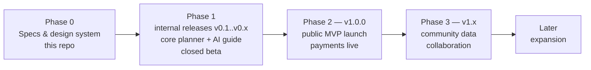
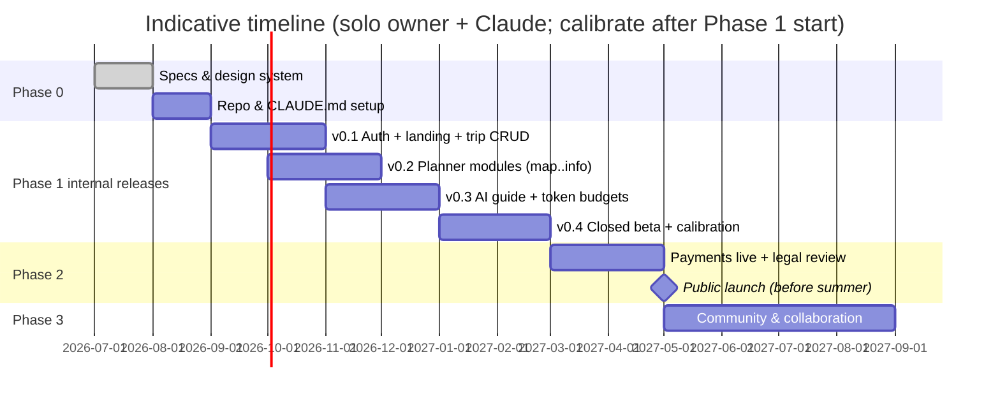

# 10 — Roadmap

> **Purpose:** Build order, the MVP cut, and the risks that shape it. Phase tags used across
> [03](03-functional-spec.md) resolve to the phases here (D-03).

---

## 1. Phases

| Phase | Scope (by feature tags) | Exit criteria |
| --- | --- | --- |
| **0 — Specification** | This `product_plan/` set + design system + new repo scaffolded per [14](14-claude-setup.md) | Specs approved by owner; repo builds hello-world with CI green |
| **1 — Internal releases → closed beta** | All `[MVP]` items delivered as **tagged internal releases (v0.x), each a testable increment** (see release train below): landing, auth incl. T&C gate, trip planner (map/itinerary/checklists/budget/weather/practical), AI guide with token budgets + usage bar, payments code-complete but **dark** (beta users run on extended trial entitlements) | 10–20 beta households plan a real trip; AI edit satisfaction ≥ 80 %; no P1 bugs for 2 weeks; **token-usage-per-message dataset collected and grant sizes calibrated (D-08)** |
| **2 — v1.0.0 public MVP launch** | Payments live (PAY-2/3/5 with calibrated grants), pricing page, production legal review of [11](11-legal-terms.md), marketing landing polish | First paying subscribers; billing + token-grant lifecycle verified end-to-end in production |
| **3 — v1.x** | `[v1.x]` items: community pipeline + heatmap + recommendations + ratings, share links, family roles, demo trip, drag-reorder, advance-booking list, admin dashboards | Community data visibly improves plans (CM metric [01 §7](01-product-vision.md)) |
| **Later** | `[Later]` items: AI-8 model-evaluation router, seasonal pass, expense logging, trip templates, dark mode, offline/PWA, per-market logins, DE/FR/NL/NO/SE localization | — |

**Release train (D-03).** Every completed increment in Phase 1 is a tagged internal release —
`v0.1.0` (auth + trip CRUD walking skeleton), `v0.2.0` (planner modules), `v0.3.0` (AI guide +
token accounting), `v0.4.0` (payments dark + closed beta start), further v0.x as increments land.
Each tag is deployable, demoable and testable end-to-end ([12](12-testing-verification.md) green),
giving rollback points and measurement checkpoints before the public **v1.0.0**.

## 2. Indicative timeline

The strategic anchor: **public launch before the 2027 summer-planning season** (European families
plan summer trips January–May; missing that window costs a year of growth).

## 3. Scope guardrails

- Payments ship **dark** in Phase 1 — beta feedback shapes pricing before real money flows.
- Community features are deliberately post-launch: they need a user base to aggregate (cold-start:
  seed recommendations from owner-verified `PLACE` data, [05 §5](05-data-model.md)).
- Anything not tagged `[MVP]` in [03](03-functional-spec.md) is out of Phase 1, no exceptions
  without a decision-log entry.

## 4. Risks & mitigations

| Risk | L×I | Mitigation |
| --- | --- | --- |
| AI cost per user exceeds revenue ([06 §8](06-ai-agent-spec.md)) | L×H | **Token budgets cap cost by construction** (paid-proportional grants, hard stop); caching + Haiku routing now, model router later; grant sizes calibrated from v0.x data before money flows |
| Solo-builder bandwidth | H×M | Claude-assisted workflow ([13](13-dev-workflow.md)); ruthless MVP cut; managed services only |
| Trust failure (agent writes bad data) | M×H | Verification rules as data ([05](05-data-model.md)), change-sets with undo, beta with real trips |
| Legal exposure (bad advice, trips gone wrong) | L×H | [11](11-legal-terms.md) T&C + disclaimers; lawyer review before public launch (Phase 2 gate) |
| Cold-start community value | H×M | Owner-seeded content; heatmap only when k≥5 satisfied |
| Seasonality | certain | Launch timing anchor (§2); seasonal-pass candidate; off-season = build season |
| Naming/trademark | H×M | "Roamly" is a working title (D-05) with a **known collision** (US RV-insurance brand roamly.com) — full trademark + domain clearance across EU markets is a hard Phase 2 gate |
| Europe-wide launch stretch (content, languages, marketing reach) | M×M | English-first UI + ~20-country seed data at MVP; localization staged in v1.x; marketing focused on 2–3 beachhead countries first |

## 5. Open questions (batched for the owner)

D-01…D-08 were confirmed 2026-07-17 ([00 §4](00-overview.md)). Remaining `> Decision needed`
items: family sharing at MVP ([02 §7](02-user-journeys.md)), card-free vs card-upfront trial
([08 §1](08-subscription-payments.md)), final grant sizes and prices (data-dependent, after v0.x
calibration), real product name/trademark clearance (this doc §4).

---

## Changelog

| Date | Change | By |
| --- | --- | --- |
| 2026-07-17 | Owner decisions applied: Phase 1 restructured as tagged internal releases v0.1–v0.4 with a release-train section, public MVP = v1.0.0 (D-03); token-usage calibration added to Phase 1 exit criteria (D-08); AI-cost risk downgraded (budgets cap by construction); Roamly trademark-collision risk raised; Europe-launch risk row added (D-05/D-06); open questions pruned to the unresolved set | Claude + Arne |
| 2026-07-16 | Document created — phases with exit criteria, gantt anchored on 2027 season, scope guardrails, risk register, open questions | Claude + Arne |
