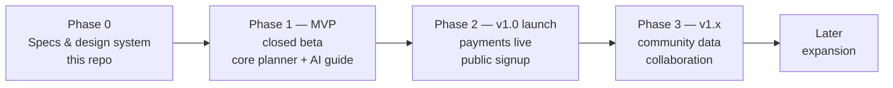
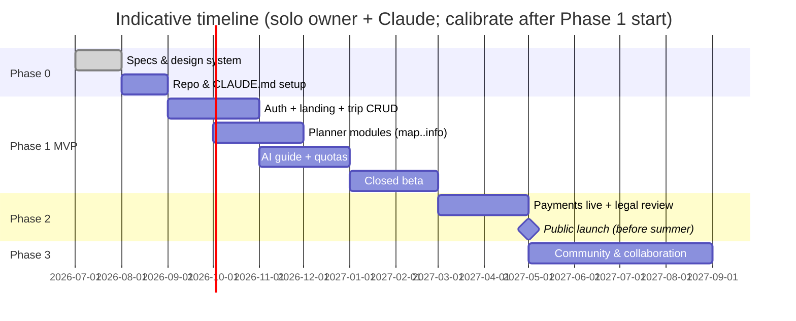

# 10 — Roadmap

> **Purpose:** Build order, the MVP cut, and the risks that shape it. Phase tags used across
> [03](03-functional-spec.md) resolve to the phases here (D-03).

---

## 1. Phases

| Phase | Scope (by feature tags) | Exit criteria |
| --- | --- | --- |
| **0 — Specification** | This `product_plan/` set + design system + new repo scaffolded per [14](14-claude-setup.md) | Specs approved by owner; repo builds hello-world with CI green |
| **1 — MVP (closed beta)** | All `[MVP]` items: landing, auth incl. T&C gate, trip planner (map/itinerary/checklists/budget/weather/practical), AI guide with quotas, payments code-complete but **dark** (everyone free-tier) | 10–20 beta households plan a real trip; AI edit satisfaction ≥ 80 %; no P1 bugs for 2 weeks |
| **2 — v1.0 public launch** | Payments live (PAY-2/3), pricing page, production legal review of [11](11-legal-terms.md), marketing landing polish | First paying subscribers; billing lifecycle verified end-to-end in production |
| **3 — v1.x** | `[v1.x]` items: community pipeline + heatmap + recommendations + ratings, Vipps login, share links, family roles, demo trip, drag-reorder, advance-booking list, admin dashboards | Community data visibly improves plans (CM metric [01 §7](01-product-vision.md)) |
| **Later** | `[Later]` items: seasonal pass, expense logging, trip templates, dark mode, offline/PWA, new-brand exploration, EN/SE/DK localization | — |

## 2. Indicative timeline

The strategic anchor: **public launch before the 2027 summer-planning season** (Norwegians plan
summer trips Jan–May; missing that window costs a year of growth).

## 3. Scope guardrails

- Payments ship **dark** in Phase 1 — beta feedback shapes pricing before real money flows.
- Community features are deliberately post-launch: they need a user base to aggregate (cold-start:
  seed recommendations from owner-verified `PLACE` data, [05 §5](05-data-model.md)).
- Anything not tagged `[MVP]` in [03](03-functional-spec.md) is out of Phase 1, no exceptions
  without a decision-log entry.

## 4. Risks & mitigations

| Risk | L×I | Mitigation |
| --- | --- | --- |
| AI cost per user exceeds model ([06 §8](06-ai-agent-spec.md)) | M×H | Quotas + caching + Haiku routing; measure from day 1; price adjustable before public launch |
| Solo-builder bandwidth | H×M | Claude-assisted workflow ([13](13-dev-workflow.md)); ruthless MVP cut; managed services only |
| Trust failure (agent writes bad data) | M×H | Verification rules as data ([05](05-data-model.md)), change-sets with undo, beta with real trips |
| Legal exposure (bad advice, trips gone wrong) | L×H | [11](11-legal-terms.md) T&C + disclaimers; lawyer review before public launch (Phase 2 gate) |
| Cold-start community value | H×M | Owner-seeded content; heatmap only when k≥5 satisfied |
| Seasonality | certain | Launch timing anchor (§2); seasonal-pass candidate; off-season = build season |
| Naming/trademark | M×M | "Feriekartet" is a working title (D-05); check trademark + domain before Phase 2 marketing |

## 5. Open questions (batched for the owner)

Collected `> Decision needed` items: D-01…D-08 confirmations ([00 §4](00-overview.md)), family
sharing at MVP ([02 §7](02-user-journeys.md)), pricing/tier confirmation and yearly-at-launch
([01 §6](01-product-vision.md), [08 §6](08-subscription-payments.md)), premium quota-exhaustion
behavior ([06 §8](06-ai-agent-spec.md)), real product name (this doc §4).

---

## Changelog

| Date | Change | By |
| --- | --- | --- |
| 2026-07-16 | Document created — phases with exit criteria, gantt anchored on 2027 season, scope guardrails, risk register, open questions | Claude + Arne |
