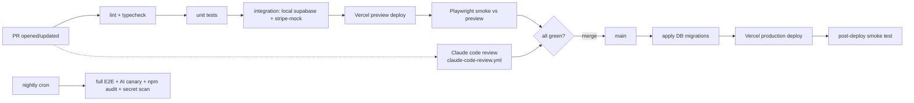

# 12 — Testing & Verification

> **Purpose:** How we know the product works — test strategy per module, and the automatic
> verification setup (CI) that enforces it on every change. Evolves the Claude-driven verification
> practice of sommerferie2026's tech spec §7 into a real pipeline.

---

## 1. Test pyramid

| Level | Tooling | Scope | Target |
| --- | --- | --- | --- |
| Static | TypeScript strict, ESLint, Prettier, `tsc --noEmit` | Everything | Zero errors, blocking |
| Unit | Vitest | Pure logic: date/leg recalculation, quota accounting, FX/weather parsing, entitlement gates, i18n keys | Fast (< 30 s), run on every commit |
| Integration | Vitest + local Supabase (CLI) + Stripe test mode | API routes, RLS policies, webhook handlers, agent tool handlers (Claude API mocked) | Every PR |
| E2E | **Playwright** (Chromium preinstalled in Claude sessions — no download step) | Real browser flows against preview deploy or local stack | Every PR (smoke set) + nightly (full) |
| Manual/beta | Closed beta households | Real-trip usage | Phase 1 exit criteria ([10](10-roadmap.md)) |

Coverage: no hard global threshold; **critical paths must be covered** (list in §2) and coverage
may not decrease on PRs touching them (ratchet).

## 2. Required coverage per module

| Module | Must-have tests |
| --- | --- |
| Auth ([07](07-auth-security.md)) | Signup blocks without T&C checkbox; acceptance row written with version; re-acceptance gate on version bump; password reset; session revocation |
| **RLS/authorization** | Automated check: every `app.*` table has RLS enabled + policy (fails CI otherwise); cross-user access attempts return zero rows — run as SQL tests against local Supabase |
| Trip planner | Stop insert/move/delete recalculates dates + adjacent legs; mode auto-selection by date; checklist check-off syncs (two clients, realtime) |
| AI agent ([06](06-ai-agent-spec.md)) | Tool handlers unit-tested with **mocked Claude API** (recorded tool-call fixtures); change-set apply + undo round-trip; quota decrement/exhaustion; `verify_url` verified/unverified paths; scoping: tools reject foreign trip ids; prompt-injection fixture (hostile fetched page must not alter another field). Scenario fixtures derived from sommerferie2026 history ([06 §7](06-ai-agent-spec.md)) |
| Payments ([08](08-subscription-payments.md)) | Stripe test-mode matrix: checkout success, 3DS challenge, card declined, `invoice.payment_failed` → past_due banner, dunning-exhausted downgrade, cancel-at-period-end, resume, webhook signature rejection, event replay idempotency |
| External data | Weather/FX cache TTL + stale-on-error fallback; API-down renders "not available" without errors |
| UX ([09](09-ux-design-spec.md)) | Playwright viewports 375/768/1280; keyboard navigation of accordion/tabs/chat; axe-core a11y scan with zero critical violations; token-pair contrast check (script) |
| Legal ([11](11-legal-terms.md)) | T&C reachable pre-signup; version shown; footer links resolve |

## 3. One live-model canary

Mocked-API tests cannot catch model drift. A small nightly **canary suite** (≤ 10 conversations,
budget-capped dev key) runs real Claude calls through golden scenarios (onboarding interview,
campsite research with verification, undo) and asserts on *tool-call structure and data effects*,
not exact wording. Failures alert, never block PRs.

## 4. CI/CD pipeline (GitHub Actions)

- **Blocking on PR:** lint, typecheck, unit, integration, E2E smoke. Claude review posts findings
  (advisory, as configured in [13](13-dev-workflow.md)).
- **Preview deploys** per PR give a clickable URL for human/Claude visual verification.
- **main = deployable, always.** Merge deploys to production after migrations apply cleanly
  (expand-migrate-contract pattern for schema changes).
- **Nightly:** full E2E matrix, AI canary, dependency + secret scans.
- Secrets: CI uses repo/environment secrets only; no secrets in code ([07 §6](07-auth-security.md)).

## 5. Claude-driven verification

The sommerferie2026 §7 practice, upgraded:

- A project **`verify` skill** in the new repo (`.claude/skills/verify`, [14](14-claude-setup.md)):
  starts the dev stack, exercises the changed flow end-to-end in Chromium (Playwright), screenshots
  at 375/768/1280, checks console errors — Claude runs it before committing any nontrivial change.
- Claude sessions must run the same commands CI runs (`npm run lint && npm run test`) before
  pushing — spec'd in the new CLAUDE.md.
- Visual review: screenshots attached to PRs for layout-affecting changes.

## 6. Environments & data

Test data = deterministic seed ([05 §5](05-data-model.md)): one demo household, one complete trip
(the 2026 Croatia trip, anonymized) — doubles as the demo trip (LP-4). Integration tests run
against ephemeral local Supabase; no test ever touches production data.

---

## Changelog

| Date | Change | By |
| --- | --- | --- |
| 2026-07-16 | Document created — pyramid, per-module required coverage incl. RLS and Stripe matrices, AI canary, CI/CD pipeline diagram, Claude verify skill, seed strategy | Claude + Arne |
