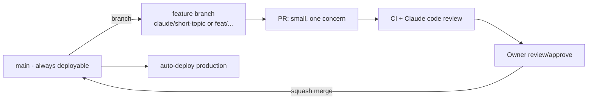

# 13 — Development Workflow

> **Purpose:** Version control and collaboration practice for building the product with Claude as
> the primary implementer and the owner as reviewer/product lead. Builds on what already works in
> the sommerferie2026 repo (Claude PR review, @claude mentions) and hardens it for a real product.

---

## 1. Repository

- **New dedicated repo** (e.g. `arnego/feriekartet` — name follows D-05), private. Structure
  defined in [14 §4](14-claude-setup.md). The sommerferie2026 repo stays untouched.
- `main` is protected: no direct pushes, PRs only, required checks = the blocking CI set
  ([12 §4](12-testing-verification.md)), linear history (squash merge).

## 2. Branching & flow

Trunk-based with short-lived branches:

- Branch naming: `claude/<topic>` for Claude sessions, `feat|fix|chore/<topic>` otherwise.
- PRs stay small (one feature/fix; large features split behind flags). Draft PRs early for
  preview-deploy feedback.
- Releases: continuous deployment from `main`; tag `vX.Y.Z` at milestones (beta, launch) for
  reference and rollback points. No release branches at this scale.

## 3. The Claude loop

Standard cycle for every nontrivial change:

1. **Plan mode** — Claude explores, asks (AskUserQuestion), writes an implementation plan; owner
   approves.
2. **Implement** on a feature branch, following the specs in `docs/product_plan` (carried into the
   new repo, [14](14-claude-setup.md)); spec changes ride in the same PR with changelog entries.
3. **Verify** — run the project `verify` skill + the CI command set locally
   ([12 §5](12-testing-verification.md)).
4. **/code-review** before pushing; fix what it finds.
5. **PR** with description of what/why, screenshots for UI, spec deltas noted.
6. **Automation reviews**: `claude-code-review.yml` runs on the PR (advisory); owner mentions
   `@claude` in comments for follow-up work; PR watching (`subscribe_pr_activity`) may babysit CI.
7. **Owner approves → squash merge → auto-deploy.**

Claude has standing permission (mirroring today's CLAUDE.md) to commit and push on feature
branches; merging to `main` is the owner's click.

## 4. Commit conventions

- Conventional-commit prefixes (`feat:`, `fix:`, `chore:`, `docs:`, `test:`, `refactor:`) — keeps
  history greppable and enables changelog generation later.
- Imperative subject ≤ 72 chars; body explains *why* when non-obvious.
- Spec/doc changes that accompany code note the doc section (e.g. `docs: update 08 §4 dunning`).

## 5. GitHub Actions inventory

| Workflow | Trigger | Role |
| --- | --- | --- |
| `ci.yml` | PR + main | Lint, typecheck, unit, integration, E2E smoke ([12 §4](12-testing-verification.md)) |
| `claude-code-review.yml` | PR open/update | Automatic Claude review (as in sommerferie2026) |
| `claude.yml` | `@claude` mentions | On-demand Claude assistant in issues/PRs |
| `nightly.yml` | cron | Full E2E, AI canary, audits |
| `deploy` | Vercel-integrated | Preview per PR, production on main |

All require `CLAUDE_CODE_OAUTH_TOKEN` / platform secrets as repo secrets.

## 6. Environments & secrets discipline

- Secrets exist only in: Vercel env config, Supabase config, GitHub Actions secrets, local
  `.env.local` (gitignored). **Never in code or docs** — the sommerferie2026 §6.4 exception
  (credentials in a private repo's HTML) explicitly does **not** carry over; users' gate codes and
  booking refs are per-user DB data ([05 §2](05-data-model.md)).
- `.env.example` documents every variable without values.
- Secret scanning + push protection enabled on the repo; CI secret scan as backstop.
- Production DB access: owner only, via Supabase dashboard; Claude works against local/preview.

## 7. Issues & planning

Lightweight: GitHub Issues with labels (`mvp`, `v1.x`, `bug`, `spec-change`), milestones per
phase ([10](10-roadmap.md)). Spec documents remain the source of truth for scope — an issue that
changes scope must update the spec + decision log in the same PR.

---

## Changelog

| Date | Change | By |
| --- | --- | --- |
| 2026-07-16 | Document created — repo/branch protection, trunk-based flow, the Claude loop, commit conventions, Actions inventory, secrets discipline | Claude + Arne |
